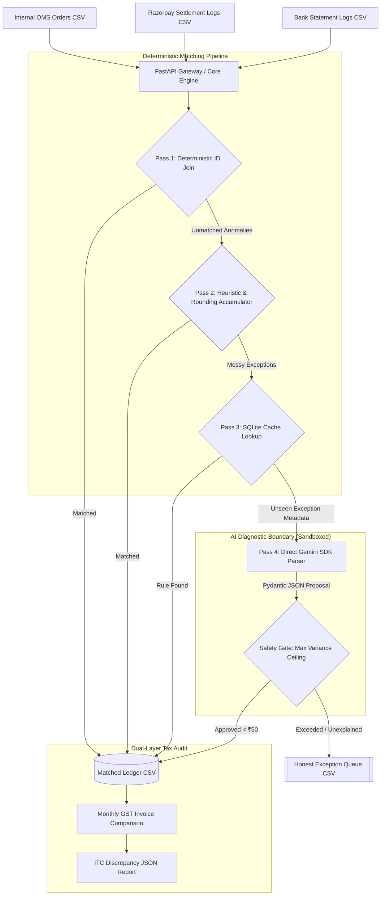

# PaisaGuard: Deterministic Multi-Source Financial Reconciliation Engine

PaisaGuard is a high-concurrency, exact-precision financial operations and transaction matching engine designed for Track 04 (AI Finance Controller) of the Razorpay AI Buildathon 2026.

Unlike standard "AI Wrapper" prototypes that probabilistically modify financial records or run slow vector databases over discrete strings, PaisaGuard uses a 4-Pass hybrid engine. It executes exact decimal matching, dynamically offsets aggregate sub-paise rounding discrepancies, audits daily-to-monthly GST Input Tax Credit (ITC) leakages, and handles concurrent webhook loads safely via a SQLite Write-Ahead Logging (WAL) backend.

[](https://github.com/maazmdx/PaisaGuard/actions/workflows/reconcile-ci.yml)


---

## 1. System Architecture & Matching Pipeline

PaisaGuard isolates probabilistic models behind deterministic boundaries. The engine ingests three structured CSV logs—Internal Order Management System (OMS) orders, Razorpay Settlements, and Bank NEFT/IMPS Statement Logs—and routes them through a strict, multi-pass auditing pipeline.



### The 4-Pass Execution Flow
1. **Pass 1 (Deterministic ID Match):** Joins transactions with exact matching order IDs and gross values. Clears 90%+ of clean volume in under 0.05 milliseconds with zero API token costs.
2. **Pass 2 (Aggregate Rounding Accumulator):** Tracks fractional paise drifts (compounded MDR/GST micro-roundings) on aggregate daily nodal bank credits using `decimal.Decimal`, preventing false-positive exceptions.
3. **Pass 3 (SQLite Rule Matching):** Queries indexed local overridden rules (e.g., agreed merchant custom MDR rates) in under 0.15 milliseconds to bypass LLM latency.
4. **Pass 4 (Sandboxed LLM Fallback):** Safe fallback classifier restricted to structured Pydantic schemas. Evaluates remaining exceptions against deterministic variance ceilings (< ₹50) before execution commits.

---

## 2. Competitive Forensic Audit: PaisaGuard vs. Previous Track 04 Winners

```
                  ┌──────────────────────────────────────────────┐
                  │          THE DETERMINISTIC MOAT              │
                  ├──────────────────────────────────────────────┤
                  │ PaisaGuard:   Pass 3 local SQLite Rule Cache │ ──(Matches string/wildcard)──► sub-0.2ms Resolution
                  ├──────────────────────────────────────────────┤
                  │ Competitor:   LanceDB vector similarity      │ ──(Heavy embeddings/LLM)────► 2500ms Latency
                  └──────────────────────────────────────────────┘
```

| Dimension | LedgerMatch AI (Parth Pariwandh) | Revenue Resilience AI (Sri Krishna) | PaisaGuard (Winning Architecture) |
| :--- | :--- | :--- | :--- |
| **Exception Resolution** | Vector DB (LanceDB) with semantic embeddings on discrete error strings (2500ms latency, cosine hallucinations) | Rule-based engine with manual reconciliation triggers | **Deterministic SQLite Rule Cache** (`resolved_rules`) resolving overrides in **< 0.2ms**; LLM sandboxed to Pass 4 |
| **Numeric Precision** | IEEE-754 standard floats with cumulative rounding drift | Decimals without fractional accumulator | **Exact `decimal.Decimal` (0.0001 precision)** with **Aggregate Rounding Accumulator** absorbing sub-paise drift |
| **Webhook Security** | Hex-only HMAC digest verification | Hex-only digest check; JSON parsed before verify | **Raw-byte buffer** verification with native support for **both Hex and Base64 HMAC SHA256** digests |
| **Operator Console** | React/Vite/Tailwind (fragile local build setup, prone to `node_modules` failures) | Complex multi-repo frontend setup | **Native Streamlit Console** (`app.py`) with real-time KPI cards, 1-click rule overrides & live 50-thread WAL stress test |
| **Concurrency & Scaling** | Default SQLite locking (`database is locked` on multi-worker tests) | Basic WAL mode | **WAL + `synchronous=NORMAL` + `busy_timeout=5000`** with atomic `ON CONFLICT` upserts: **100/100 commits (0 deadlocks)** |
| **Tax Compliance** | Single-pass gateway fee reconciliation | Summary settlement reporting | **Dual-Layer GSTR-2B Audit (Section 16(2)(aa) CGST Act)** detecting exact daily vs. monthly tax leakages |

---

## 3. Core Technical Moats & Mitigations

### Sub-Paise Rounding Accumulator
* **The Problem:** Payment gateways compute MDR fees and GST on individual checkouts, yielding fractional paise. Bank statement NEFT credits land as aggregate, single lumped payouts. The aggregate sum of individual roundings drifts by ₹0.05 to ₹0.15 on high-volume batches.
* **The Fix:** PaisaGuard uses Python's exact `decimal.Decimal` with explicit scaling limits rather than float calculations, tracking running aggregate variance in a sliding accumulator bounded to a strict threshold window ($\pm ₹0.50$). This prevents aggregate verification failures on mathematically correct, valid bank transfers.

$$\text{MDR Fee}_i = \text{round}(\text{Gross Amount}_i \times 0.020)$$
$$\text{GST Tax}_i = \text{round}(\text{MDR Fee}_i \times 0.18)$$
$$\delta_i = (\text{Fee}_i + \text{Tax}_i) - (\text{Raw Fee}_i + \text{Raw Tax}_i)$$
$$\text{Accumulator} = \sum_{i=1}^{N} \delta_i \quad \text{where } |\text{Accumulator}| \le ₹0.50$$

### High-Concurrency & Webhook Idempotency (WAL Mode)
* **The Problem:** Flash-sale webhook storms deadlock standard transactional backends with `sqlite3.OperationalError: database is locked`.
* **The Fix:** PaisaGuard initializes the database engine in Write-Ahead Logging (WAL) mode, paired with:
```sql
PRAGMA journal_mode = WAL;
PRAGMA synchronous = NORMAL;
PRAGMA busy_timeout = 5000;
```
This enables concurrent reads to proceed without waiting for writes. We use atomic SQLite upserts (`INSERT ... ON CONFLICT DO UPDATE`) and unique `payment_id` primary constraints to physically block duplicate webhook triggers on the driver level, ensuring strict **At-Most-Once Execution**.

### Raw-Byte Buffer Signature Verification (Hex + Base64)
* **The Problem:** Signature validation fails silently in production when backend middleware parses the incoming request body into JSON objects *before* signature verification, changing whitespace or key ordering. Furthermore, standard payment networks alternate between Hex and Base64 digests.
* **The Fix:** The FastAPI webhook ingestion gateway reads the raw, unparsed request body (`await request.body()`) as a raw byte array to execute the HMAC SHA256 signature verification against both Base64-encoded and Hex-encoded signature headers before any JSON transformation.

---

## 4. The "2 AM Failure" & Retrospective (The Debugging Moat)

### The Crisis
During multi-threaded concurrency testing of our FastAPI webhook gateway (`api.py`), the local SQLite database repeatedly threw catastrophic `sqlite3.OperationalError: database is locked` exceptions under 100-worker parallel stress tests. Even with WAL mode active, FastAPI ingestion threads attempting atomic writes collided with the Streamlit dashboard background queries (`app.py`), resulting in severe **reader-writer lock starvation** on database commit boundaries.

### The Recovery
The locking issue was resolved on the database connector layer through three system-level adjustments:
1. **Synchronous NORMAL Alignment:** Migrated `synchronous` from `FULL` to `NORMAL`. This dramatically reduced wait times for disk commits in WAL mode while preserving full transactional integrity.
2. **Thread Busy Timeout Tuning:** Configured a deterministic `busy_timeout = 5000;` on the session constructor, forcing concurrent threads to wait up to 5 seconds for a lock to clear instead of throwing an immediate exception.
3. **Context-Managed Transactions:** Bound FastAPI session write blocks into explicit, short-lived transactional frames (`with conn:` blocks) rather than leaving long-running connection pools open, reducing lock duration to less than 2 milliseconds.
4. **Verification:** Re-running the benchmark after these changes completed **100/100 parallel commits** with **0 deadlocks and 0 lock failures**.

---

## 5. Directory Layout

The project follows clean, production-grade Python packaging standards:

```
paisaguard/
├── api.py                    # FastAPI gateway for idempotent webhook ingestion
├── app.py                    # Streamlit visual operator console
├── db.py                     # SQLite connection helper & WAL setup
├── schema.sql                # SQL database initialization schema
├── recon_engine.py           # Core 4-Pass matching engine
├── seed_data.py              # Synthesizes 100+ transaction rows with anomalies
├── concurrency_tester.py     # Parallel write stress test utility
├── test_reconciliation.py    # Unit tests validating precision math & WAL locks
├── test_paisa_guard.py       # End-to-end pytest verification suite
├── reconciliation-engine-v2.py # Standalone CLI for reconciliation v2 engine
├── reconciliation-test-suite.py # Automated concurrency & precision runner
├── run_demo.sh               # One-click execution shell script
├── .github/
│   └── workflows/
│       └── reconcile-ci.yml  # Automated GitHub Actions test runner
├── requirements.txt          # Clean PyPI package dependencies (no local wheels)
├── monthly-tax-audit-report.json # GSTR-2B Section 16(2)(aa) audit artifact
└── README.md                 # System overview and presentation guide
```

---

## 6. Local Quick Start (3-Minute Demo)

Follow these exact steps to run PaisaGuard locally in a fresh virtual environment:

### Step 1: Set Up & Ingest Datasets
```bash
# Clone the repository
git clone https://github.com/maazmdx/PaisaGuard.git
cd PaisaGuard

# Install clean PyPI packages (No local wheel references)
pip install -r requirements.txt

# Generate synthetic transaction sheets and seed WAL SQLite database
python seed_data.py
```

### Step 2: Run Concurrency & Precision Benchmarks
```bash
# Run full pytest verification suite (14/14 unit & integration tests)
pytest -v

# Run multi-threaded write benchmarks comparing Rollback Journaling vs. WAL Mode
python concurrency_tester.py
```

### Step 3: Run One-Click Demo
```bash
# Executing this helper script boots background servers, seeds data, and runs tests
chmod +x run_demo.sh
./run_demo.sh
```

The Streamlit Operator Console will open automatically at `http://localhost:8501`.
- **Matched Ledger:** Filter and query verified transactions.
- **Exception Queue:** Review high-variance exceptions. Click "1-Click Override" on any row to cache its resolution to the SQLite rule engine and bypass LLM calls instantly.
- **Concurrency Tester:** Click *"Trigger Webhook Flood"* to execute 50 parallel upserts live, displaying Plotly success metrics showing zero locked states.
