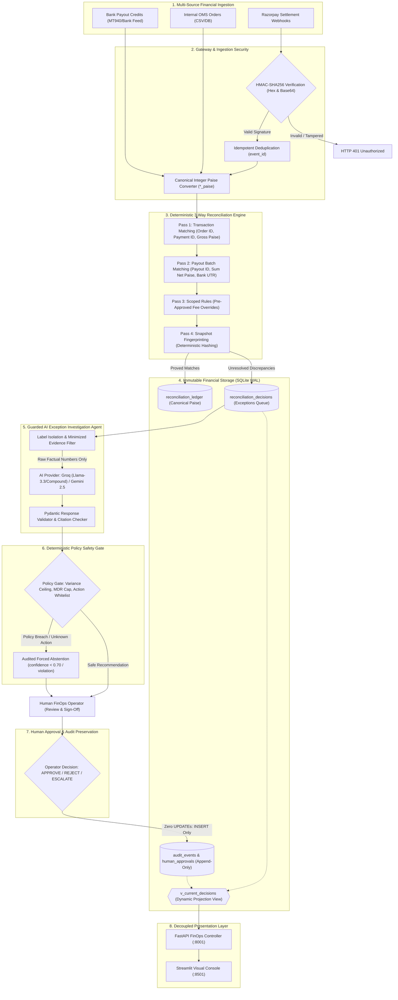

# PaisaGuard

**Deterministic Three-Way Payment Reconciliation & Guarded AI Exception Controller**  
*Built for the Razorpay AI Buildathon 2026 — Track 04: AI Finance Controller*

---

> **Core Philosophy**: Deterministic logic balances the financial ledger. Guarded AI explains the anomalies. Humans make the final decisions.

PaisaGuard reconciles an internal Order Management System (OMS), payment gateway settlements (Razorpay), and inbound bank payout credit feeds. It automatically matches records with mathematical proof, isolates discrepancies into a prioritized exception queue, and uses a live AI agent to diagnose root causes—**without granting the model write access to financial ledgers or payment authority.**

---

## Architecture & Data Flow



### Core Architectural Pillars

| Architectural Pillar | Implementation Details |
| :--- | :--- |
| **Pure Canonical Paise** | All monetary values are strictly stored and computed as integer `*_paise` (e.g. ₹1,500.00 = `150000`). Zero floating-point representation errors. |
| **Deterministic 3-Way Matching** | Evaluates order IDs, payment IDs, UTR bank references, and fee/GST basis points in 4 deterministic pipeline passes. |
| **Dual Live AI Provider Support** | First-class native REST integration with **Groq** (`llama-3.3-70b-versatile` / `groq/compound`) and **Gemini** (`gemini-2.5-flash`), plus offline deterministic mock for CI. |
| **Ground-Truth Label Isolation** | AI prompts receive **only factual numbers, fees, and timestamps**; diagnosis labels and ground-truth codes are strictly excluded. |
| **Deterministic Policy Safety Gate** | Hard ceilings enforce a ₹50.00 (5,000 paise) maximum variance, 3.50% MDR cap, and action whitelist (`policy_gate.py`). |
| **Strictly Append-Only Audit Trail** | Zero destructive SQL `UPDATE` operations on decisions or ledgers. Decisions are projected dynamically via SQL views (`v_current_decisions`). |
| **Dual-Encoding HMAC Webhook Gateway** | Constant-time HMAC-SHA256 signature verification supporting both Hex and Base64 encodings with idempotent event deduplication. |
| **Isolated Dashboard Architecture** | Streamlit UI communicates **100% via FastAPI HTTP endpoints** with zero direct database volume access. |

---

## Measured Benchmark Results

Evaluated against a synthetic 3-source dataset (100 operational transactions + 30 held-out evaluation cases):

| Metric | Result | Target Benchmark |
| :--- | :--- | :--- |
| **Operational Auto-Match Rate** | **88.0%** (88 / 100) | $\ge 80\%$ |
| **Matcher Precision / Recall** | **100.0% / 100.0%** | $100\%$ (0 false positives) |
| **Engine Throughput** | **658+ records/sec** | $\ge 100$ records/sec |
| **Sweep Latency (p50 / p95)** | **372ms / 525ms** | $< 1000$ms |
| **Offline Baseline Diagnostic Accuracy** | **100.0%** (14 / 14 non-abstained) | $\ge 90\%$ |
| **Deliberate Abstention Fidelity** | **100.0%** (3 / 3 ambiguous cases) | $100\%$ |
| **Final Resolution Accuracy** | **100.0%** (17 / 17 correct dispositions) | $\ge 95\%$ |
| **Automated Test Suite** | **46 / 46 Passing** (`pytest -q`) | $100\%$ |
| **Database Concurrency (WAL Mode)** | **100% Lock-Free** (0 deadlocks) | $100\%$ |

*Generate the authoritative benchmark report anytime with `python eval_benchmarks.py` (writes to `out/evaluation-report.json` and `out/evaluation-report.md`).*

---

## Quick Start (One-Click Launcher)

**Prerequisites**: Linux / macOS, Python 3.12, bash, curl.

```bash
# 1. Clone repository
git clone https://github.com/maazmdx/PaisaGuard.git
cd PaisaGuard

# 2. Configure environment
cp .env.example .env

# 3. Launch the complete system
./run_demo.sh
```

The launcher:
1. Prepares the Python virtual environment and verifies exact pinned dependencies.
2. Seeds SQLite with 385 synthetic multi-source records (WAL mode).
3. Executes the full test suite (`pytest -q`) and benchmark evaluation.
4. Starts the **FastAPI Webhook Gateway** on `http://localhost:8001`.
5. Proves signed webhook ingestion with live Hex and Base64 HMAC replays.
6. Launches the **Streamlit Operator Console** on `http://localhost:8501`.

To run the automated verification and signed webhook demonstration and exit cleanly:
```bash
./run_demo.sh --exit-after-webhooks
```

---

## Live AI Provider Configuration

PaisaGuard supports **Groq**, **Gemini**, and an offline **Mock** baseline. Configure your provider in `.env`:

### Option A: Groq (Recommended for Speed & Llama 3.3)
```env
AI_PROVIDER=groq
AI_MODEL=llama-3.3-70b-versatile
GROQ_API_KEY=gsk_your_groq_api_key_here
```

### Option B: Google Gemini
```env
AI_PROVIDER=gemini
AI_MODEL=gemini-2.5-flash
AI_API_KEY=your_gemini_api_key_here
```

### Option C: Offline Mock (Default for CI)
```env
AI_PROVIDER=mock
```

### Verify Provider Readiness Safely
Verify AI connectivity without exposing your secret API key:
```bash
# CLI Preflight Check
.venv/bin/python exception_agent.py --preflight

# Or via API
curl http://localhost:8001/ai/preflight
```


---

## API Surface

| Method | Endpoint | Authentication | Purpose |
| :--- | :--- | :--- | :--- |
| `GET` | `/` | None | Service status, active AI provider, and security flags |
| `POST` | `/webhooks/razorpay` | `X-Razorpay-Signature` | Ingests signed Razorpay webhooks (Hex/Base64, canonical paise) |
| `POST` | `/reconcile/sweep` | `X-PaisaGuard-Token` | Triggers deterministic 3-way reconciliation pipeline |
| `POST` | `/ai/investigate` | `X-PaisaGuard-Token` | Runs guarded AI investigation with policy safety gate |
| `POST` | `/approvals/decision` | `X-PaisaGuard-Token` | Appends a human operator resolution (APPROVE, REJECT, ESCALATE) |
| `GET` | `/ai/preflight` | None | Safe preflight check reporting AI provider readiness |
| `GET` | `/metrics` | None | Operational reconciliation KPIs and summary statistics |
| `GET` | `/payouts` | None | Payout batch status and bank credit records |
| `GET` | `/exceptions` | None | Open exception queue projected from `v_current_decisions` |
| `GET` | `/audit-events` | None | Append-only timeline of audit logs and human decisions |
| `GET` | `/evaluation-report` | None | Latest measured accuracy and performance JSON report |
| `GET` | `/metrics/prometheus`| None | Prometheus-compatible metrics exposition |

---

## Local Development & Testing

```bash
# Activate virtual environment
source .venv/bin/activate

# 1. Run full automated test suite (46 tests)
pytest -q

# 2. Run benchmark evaluation
python eval_benchmarks.py

# 3. Run adversarial concurrency benchmark (WAL mode vs Rollback journal)
python concurrency_tester.py

# 4. Check code quality & formatting
ruff check . && ruff format --check .
```

---

## Repository Structure

```text
PaisaGuard/
├── api.py               # FastAPI gateway, webhooks, security headers, and read APIs
├── app.py               # Streamlit FinOps operator console (HTTP-only)
├── recon_engine.py      # Deterministic 3-way reconciliation engine (Passes 1–4)
├── exception_agent.py   # AI exception agent (Groq, Gemini, Deterministic Mock)
├── policy_gate.py       # Deterministic safety gate (MDR cap, ₹50 variance ceiling)
├── audit_service.py     # Append-only human approval service and state projection
├── money.py             # Canonical integer paise precision utilities and type guards
├── db.py                # SQLite WAL connection manager and audit event logger
├── eval_benchmarks.py   # Automated benchmark evaluation and accuracy reporter
├── concurrency_tester.py# Adversarial concurrency benchmark tester
├── replay_webhooks.py   # Synthetic webhook replay and security test harness
├── seed_data.py         # Multi-source synthetic financial ledger seeder
├── schema.sql           # Database schema with integer paise columns and views
├── test_paisa_guard.py  # Comprehensive end-to-end and unit test suite
├── test_hmac.py         # Isolated HMAC-SHA256 signature verification tests
├── run_demo.sh          # Self-contained demo launcher and verification runner
└── requirements.txt     # Exact pinned Python dependencies
```

---

## License

Distributed under the **MIT License**. Developed for the **Razorpay AI Buildathon 2026**.
