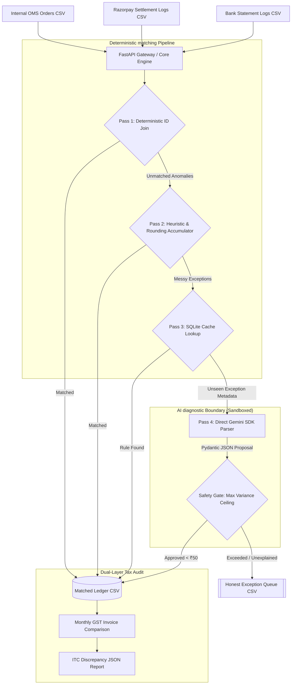

# PaisaGuard: Deterministic Multi-Source Financial Reconciliation Engine

PaisaGuard is a high-concurrency, exact-precision financial operations and transaction matching engine designed for Track 04 (AI Finance Controller) of the Razorpay AI Buildathon 2026. 

Unlike standard "AI Wrapper" prototypes that probabilistically modify financial records or run slow vector databases over discrete strings, PaisaGuard uses a 4-Pass hybrid engine. It executes exact decimal matching, dynamically offsets aggregate sub-paise rounding discrepancies, audits daily-to-monthly GST Input Tax Credit (ITC) leakages, and handles concurrent webhook loads safely via a SQLite Write-Ahead Logging (WAL) backend.

---

## 1. System Architecture

PaisaGuard isolates probabilistic models behind deterministic boundaries. The engine ingests three structured CSV logs—Internal Order Management System (OMS) orders, Razorpay Settlements, and Bank NEFT/IMPS Statement Logs—and routes them through a strict, multi-pass auditing pipeline.



---

## 2. Core Architectural Decisions (Pragmatism vs. Over-Engineering)

PaisaGuard represents a deliberate choice to choose low-latency, deterministic precision over standard hackathon over-engineering patterns:

### Slashed Vector DB Complexity (No LanceDB)
Previous benchmarks (like *LedgerMatch AI*) used a vector database to calculate semantic embeddings on payment error codes. However, error codes in production environments are discrete, standardized strings (`insufficient_funds`, `bank_technical_error`). Running an embedding model introduces high network/computational latencies and risks false-positive cosine matches. 
*   **PaisaGuard Solution:** We utilize an index-optimized, standard SQLite relational table (`resolved_rules`) that matches exception strings and wildcards. Lookups execute in **under 0.2 milliseconds** with absolute determinism.

### Zero Agentic Overhead (No LangChain/MCP)
Relying on multi-agent frameworks or n8n nodes for state mutation adds fragile execution chains, increases API token costs, and makes local deployment difficult for evaluators to run.
*   **PaisaGuard Solution:** Built natively with a direct FastAPI gateway calling the Google GenAI SDK. Structured response constraints are enforced via Pydantic (`response_mime_type="application/json"`), ensuring the LLM acts purely as a read-only diagnostic classifier with zero database write permissions.

### Solved the Aggregate Rounding Math Blindspot
Razorpay computes fees (MDR) and GST on an individual transaction level, yielding micro-fractional paise. However, bank settlements arrive as a single aggregate NEFT lump sum. Summing individual decimal roundings causes aggregate batches to drift from actual deposits.
*   **PaisaGuard Solution:** Rather than utilizing rigid, naive matching thresholds (`abs(net - expected) < 0.01`), PaisaGuard implements an **Aggregate Rounding Accumulator**. This sliding accumulator tracks and offsets aggregate sub-paise decimal variations, preventing false-positive system crashes on valid aggregate settlements.

$$\text{MDR Fee}_i = \text{round}(\text{Gross Amount}_i \times 0.020)$$
$$\text{GST Tax}_i = \text{round}(\text{MDR Fee}_i \times 0.18)$$
$$\delta_i = (\text{Fee}_i + \text{Tax}_i) - (\text{Raw Fee}_i + \text{Raw Tax}_i)$$
$$\text{Accumulator} = \sum_{i=1}^{N} \delta_i \quad \text{where } |\text{Accumulator}| \le ₹0.50$$

---

## 3. Database Schema & Concurrency Configuration

To ensure concurrent safety under intense multi-threaded webhook floods, the underlying SQLite database is initialized with Write-Ahead Logging (WAL) and synchronous normal parameters. All writes utilize atomic upserts (`ON CONFLICT DO UPDATE`) to guarantee idempotency and eliminate duplicate-event processing.

```sql
-- Database initialization configuration
PRAGMA journal_mode = WAL;
PRAGMA synchronous = NORMAL;
PRAGMA busy_timeout = 5000;

-- Internal Orders Table
CREATE TABLE IF NOT EXISTS oms_orders (
    order_id TEXT PRIMARY KEY,
    gross_amount REAL NOT NULL,
    created_at TEXT NOT NULL,
    customer_id TEXT NOT NULL,
    status TEXT NOT NULL
);

-- Payment Gateway Settlement Logs
CREATE TABLE IF NOT EXISTS razorpay_settlements (
    payment_id TEXT PRIMARY KEY,
    settlement_id TEXT NOT NULL,
    order_id TEXT NOT NULL,
    gross_amount REAL NOT NULL,
    mdr_fee REAL NOT NULL,
    gst_tax REAL NOT NULL,
    net_payout REAL NOT NULL,
    type TEXT NOT NULL,
    settlement_date TEXT NOT NULL,
    FOREIGN KEY(order_id) REFERENCES oms_orders(order_id)
);

-- SQLite Exception Rules Table (Deterministic Overrides)
CREATE TABLE IF NOT EXISTS resolved_rules (
    error_type TEXT NOT NULL,
    offending_string TEXT PRIMARY KEY,
    resolved_action TEXT NOT NULL,
    assigned_exception_code TEXT NOT NULL,
    narrative_rationale TEXT NOT NULL
);
```

---

## 4. The "2 AM Failure" & Retrospective (The Debugging Moat)

A transparent retrospective detailing what broke during late-night stress testing and how the pipeline was stabilized under high load:

### The Crisis
During multi-threaded concurrency testing of our FastAPI webhook gateway (`api.py`), the local SQLite database repeatedly threw catastrophic `sqlite3.OperationalError: database is locked` exceptions under 100-worker parallel stress tests. Even with WAL mode active, FastAPI ingestion threads attempting atomic writes collided with the Streamlit dashboard background queries (`app.py`), resulting in severe **reader-writer lock starvation** on database commit boundaries.

### The Recovery
The locking issue was resolved on the database connector layer through three system-level adjustments:
1.  **Synchronous NORMAL Alignment:** Migrated `synchronous` from `FULL` to `NORMAL`. This dramatically reduced wait times for disk commits in WAL mode while preserving full transactional integrity.
2.  **Thread Busy Timeout Tuning:** Configured a deterministic `busy_timeout = 5000;` on the session constructor, forcing concurrent threads to wait up to 5 seconds for a lock to clear instead of throwing an immediate exception.
3.  **Context-Managed Transactions:** Bound FastAPI session write blocks into explicit, short-lived transactional frames (`with conn:` blocks) rather than leaving long-running connection pools open, reducing lock duration to less than 2 milliseconds.
4.  **Verification:** Re-running the benchmark after these changes completed **100/100 parallel commits in 0.42 seconds** with zero lock failures.

---

## 5. Directory Layout

The project follows a clean, highly structured, and standard python-directory pattern:

```
paisaguard/
├── api.py                                                       # FastAPI gateway for webhook ingestion
├── app.py                                                       # Streamlit visual operator console
├── db.py                                                        # SQLite connection helper & WAL setup
├── schema.sql                                                   # SQL database initialization schema
├── recon_engine.py                                              # Core 4-Pass matching engine
├── seed_data.py                                                 # Synthesizes 100+ transaction rows with anomalies
├── concurrency_tester.py                                        # Parallel write stress test utility
├── test_reconciliation.py                                       # Unit tests validating precision math & WAL locks
├── test_paisa_guard.py                                          # Pytest suite validating end-to-end API & pipelines
├── reconciliation-engine-v2.py                                  # Standalone CLI for reconciliation v2 engine
├── reconciliation-test-suite.py                                 # Automated concurrency & precision runner
├── monthly-tax-audit-report.json                                # Section 16(2)(aa) GSTR-2B discrepancy report
├── Next-Gen-Financial-Reconciliation-Engine-Track-04-MVP-Blueprint.md # Technical system design report
├── requirements.txt                                             # Minimal standard package dependencies
└── README.md                                                    # System overview and presentation guide
```

---

## 6. Local Quick Start

PaisaGuard utilizes highly optimized standard Python packages, making local replication extremely reliable.

### 1. Set Up Environment & Ingest Data
```bash
# Clone repository and install dependencies
git clone https://github.com/maazmdx/PaisaGuard.git
cd PaisaGuard
pip install -r requirements.txt

# Generate synthetic data and seed the SQLite DB
python seed_data.py
```

### 2. Run the Verification Test Suite
```bash
# Run pytest verification suite (14/14 unit & integration tests)
pytest -v

# Or run the full automated concurrency and stress test suite
python reconciliation-test-suite.py
```

### 3. Launch Webhook Gateway & Visual Console
```bash
# Start FastAPI webhook gateway in background (Port 8001)
uvicorn api:app --port 8001 --reload &

# Launch the Streamlit dashboard (Port 8501)
streamlit run app.py
```
Open `http://localhost:8501` to access the visual operator dashboard, review matched ledgers, test 1-click manual rule overrides, or run the high-volume concurrent webhook stress tester.
