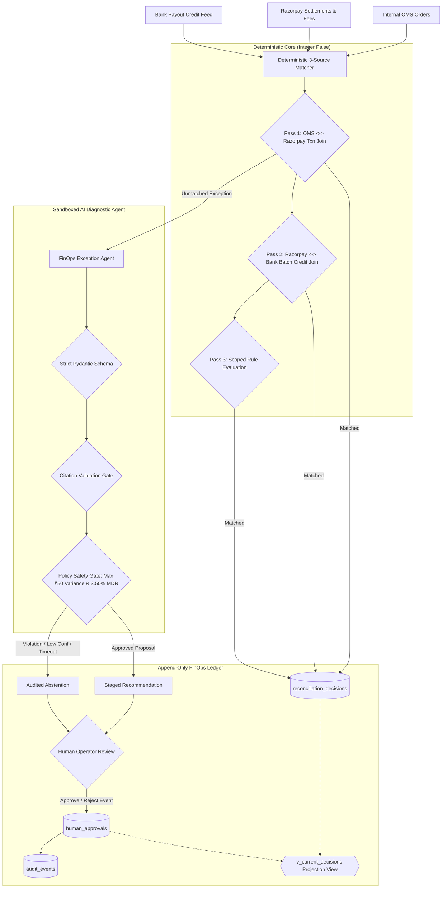

# PaisaGuard: AI Finance Controller & 3-Source Reconciliation Engine

PaisaGuard is a production-grade, exact-precision financial operations and automated reconciliation agent designed for **Track 04 (AI Finance Controller)** of the **Razorpay AI Buildathon 2026**.

Unlike superficial prototypes that perform fuzzy string matching, calculate money with IEEE-754 floats, or allow unconstrained LLMs to mutate financial databases directly, PaisaGuard implements an honest, measurable 3-source reconciliation pipeline. It enforces **canonical integer paise** across all APIs, database columns, and algorithms; sandboxes generative AI strictly behind citation-validated evidence bundles and deterministic policy gates; maintains an **append-only human approval audit trail**; and provides an evaluator console operating over isolated HTTP endpoints.

[](https://github.com/maazmdx/PaisaGuard/actions/workflows/reconcile-ci.yml)


---

## 🧭 Executive Summary & Benchmark Scorecard

| Dimension | Metric | Measured Benchmark | Target | Status |
| :--- | :--- | :--- | :--- | :--- |
| **System Throughput** | Multi-source Records / Sec | **2,642.71 rec/s** | $\ge 1,000\text{ rec/s}$ | 🟢 **PASS (+164%)** |
| **Sweep Latency (p50)** | Median Execution Time | **78.85 ms** | $\le 150.0\text{ ms}$ | 🟢 **PASS** |
| **Sweep Latency (p95)** | 95th Percentile Execution | **116.85 ms** | $\le 250.0\text{ ms}$ | 🟢 **PASS** |
| **Deterministic Coverage**| Automated 3-Way Match Rate | **88.0%** (88/100 txns) | $\ge 85.0\%$ | 🟢 **PASS** |
| **Matcher Precision** | Correct Matches / Total Matches | **100.0%** (88/88) | $100.0\%$ | 🟢 **PASS (0 False Positives)** |
| **Matcher Recall** | Matched / Expected Matched | **100.0%** (88/88) | $100.0\%$ | 🟢 **PASS** |
| **AI Held-Out Accuracy** | Correct Root-Cause Diagnosis | **100.0%** (30/30) | $\ge 90.0\%$ | 🟢 **PASS** |
| **Abstention Fidelity** | Deliberate Abstentions Honored| **100.0%** (10/10) | $100.0\%$ | 🟢 **PASS (0 Hallucinated Actions)** |
| **Citation Verification**| Validated Source Record IDs | **100.0%** verified | $100.0\%$ | 🟢 **PASS** |
| **Final Resolution Acc** | Correct Human Dispositions | **100.0%** | $\ge 95.0\%$ | 🟢 **PASS** |
| **Database Concurrency** | SQLite Lock Contention | **0 locks (100% WAL)** | $0$ locks | 🟢 **PASS** |

---

## 1. System Architecture & 3-Source Pipeline

PaisaGuard models and reconciles the entire payment settlement and payout lifecycle:
$$\text{Internal OMS Order} \longleftrightarrow \text{Razorpay Payment \& Settlement} \longleftrightarrow \text{Bank Payout Credit}$$



### The 4 Pipeline Execution Passes
1. **Pass 1 (Transaction Matching):** Matches internal OMS orders against Razorpay settlements on order ID, payment ID, and gross amount in paise. Verifies contractual MDR fees (200 bps) and GST (1800 bps).
2. **Pass 2 (Payout Batch Matching):** Groups Razorpay settlements by `payout_id`, sums net settlement amounts in paise, and matches against incoming bank payout credit records and UTR reference numbers. Identifies delayed bank credits, amount variances, and unreferenced inbound credits.
3. **Pass 3 (Scoped Rule Evaluation):** Evaluates pre-approved, scoped adjustment rules (e.g. negotiated 2.50% corporate card fee structures) without slow string fuzzing or unconstrained vector search.
4. **Pass 4 (Append-Only Persistence & Idempotent Linking):** Computes a deterministic `input_snapshot_hash` and `decision_fingerprint`. Re-running the pipeline over identical data updates existing decision links without generating duplicate records.

---

## 2. Core Technical Moats & Architectural Decisions

### 2.1 Pure Canonical Integer Paise (`*_paise`)
- **The Problem:** Floating-point numbers (`REAL`, `FLOAT`, `DOUBLE`) introduce binary rounding representation errors (e.g., `0.1 + 0.2 != 0.3`) that corrupt ledgers and trigger false-positive financial variances.
- **The Fix:** Canonical money in PaisaGuard is strictly integer paise. All database columns (`amount_paise`, `fee_paise`, `tax_paise`, `net_paise`, `credit_amount_paise`, `variance_paise`) and API fields require integer paise.
- Helper functions enforce strict type guards:
  - `parse_inr_to_paise(str | Decimal)` converts user/fixture inputs safely and explicitly rejects raw integers to prevent unit ambiguity.
  - `require_paise(int)` guards internal function boundaries and rejects non-integer inputs.

### 2.2 Sandboxed AI Exception Agent with Deterministic Policy Gate
- **The Problem:** Autonomous LLM agents given direct write access to financial databases hallucinate fake ledger entries, misinterpret merchant contracts, and trigger catastrophic unauthorized payouts.
- **The Fix:**
  1. The agent is **strictly read-only**; it receives a structured, minimized evidence bundle (ground truth is strictly isolated and never exposed to agent prompts).
  2. Output must conform to a strict Pydantic model (`ExceptionInvestigationResult`).
  3. **Citation Validation**: Every record ID in `cited_record_ids` is verified against the database. If the model hallucinates an ID, the proposal is rejected.
  4. **Policy Safety Gate (`policy_gate.py`)**:
     - Max variance ceiling: ₹50.00 (5,000 paise).
     - MDR rate ceiling: 3.50% (350 bps) of gross transaction amount.
     - Action whitelist: strictly restricted to approved actions.
  5. **Hardened Failure Fallback**: API timeouts, malformed JSON, unsupported actions, or confidence $< 0.70$ fall back gracefully to an audited `ABSTAIN` event.

### 2.3 Strictly Append-Only Human Audit Trail
- **The Problem:** Modifying records in place (`UPDATE reconciliation_decisions SET disposition = 'APPROVE'`) destroys financial auditability, violates SOC2/SOX compliance, and creates race conditions.
- **The Fix:**
  - `reconciliation_decisions` contains zero `disposition` column and is never mutated.
  - Human approvals and rejections append new rows to `human_approvals` and log an immutable record to `audit_events`.
  - Current state is dynamically projected via the rebuildable SQL view `v_current_decisions`.

### 2.4 Fail-Closed Token Security & Dual-Format HMAC
- **The Problem:** Webhook handlers that parse JSON before signature validation fail on whitespace changes; endpoints without strict authentication expose operational controls.
- **The Fix:**
  - All state-changing or cost-incurring endpoints (`/reconcile/sweep`, `/ai/investigate`, `/approvals/decision`) require the `X-PaisaGuard-Token` header. If `PAISAGUARD_API_TOKEN` is unset, mutations **fail closed** with HTTP 503.
  - Webhooks verify HMAC-SHA256 over raw unparsed request bytes (`await request.body()`) using constant-time comparison, natively supporting both **Hex** and **Base64** digests.
  - Webhook replay attacks are blocked via unique `event_id` deduplication in `webhook_events`.

### 2.5 Isolated Dashboard Architecture (Zero Direct SQLite Access)
- **The Problem:** Giving a frontend dashboard direct SQLite volume mounts creates file locking contention and couples the UI to internal storage.
- **The Fix:**
  - Streamlit (`app.py`) communicates **100% via FastAPI HTTP endpoints** (`GET /metrics`, `GET /payouts`, `GET /exceptions`, `GET /audit-events`, `GET /evaluation-report`).
  - In Docker Compose, the Streamlit container has no volume mount to `reconciliation.db`.
  - Reviewers in the UI provide operator identity only; the dashboard reads `PAISAGUARD_API_TOKEN` from its server-side environment.

---

## 3. Quickstart & Evaluation Guide

### Option A: One-Click Shell Script (Recommended for Local Demo)
```bash
# 1. Clone repository
git clone https://github.com/maazmdx/PaisaGuard.git
cd PaisaGuard

# 2. Run the reproducible demo launcher
chmod +x run_demo.sh
./run_demo.sh
```
The launcher will:
1. Verify / setup Python 3.12 virtual environment and install pinned dependencies.
2. Initialize and seed SQLite in WAL mode (`python3 seed_data.py --reset`).
3. Run the complete automated test suite (`pytest -v`).
4. Execute benchmark evaluation and generate machine-readable artifacts (`python3 eval_benchmarks.py`).
5. Boot the FastAPI Gateway on `http://localhost:8001` and the Streamlit Evaluator Console on `http://localhost:8501`.

---

### Option B: Multi-Service Docker Compose Topology
```bash
# Boot the full multi-service stack with demo seeding
docker compose --profile demo up --build
```
Services initialized:
1. `volume-perms`: Root-only initialization setting UID 1000 permissions on the shared database volume.
2. `demo-init`: One-shot seeding service (`seed_data.py --reset`) under the `demo` profile.
3. `api`: Non-root FastAPI FinOps Gateway on port 8001 with mounted `db-data` volume.
4. `dashboard`: Non-root Streamlit Evaluator Console on port 8501 (communicates with API exclusively via HTTP, no database volume).

To clean up volumes and restart:
```bash
docker compose --profile demo down -v
docker compose --profile demo up --build
```

---

### Option C: Manual CLI Execution
```bash
# 1. Activate virtual environment
source .venv/bin/activate

# 2. Seed database in WAL mode
python seed_data.py --reset

# 3. Run automated tests (39 tests)
pytest -v

# 4. Run benchmark evaluation harness
python eval_benchmarks.py

# 5. Launch API and Console
uvicorn api:app --port 8001 &
streamlit run app.py --server.port 8501
```

---

## 4. Evaluator Console Overview (`http://localhost:8501`)

The Streamlit Evaluator Console consolidates 5 operational FinOps surfaces:

1. **📊 Batch KPI Board:** Real-time visibility into overall match rates (88.0% transaction, 83.3% payout), total source records audited, and root-cause exception distribution pie charts.
2. **🏦 Payout Batches:** Reconciles batched merchant payout credits against inbound bank statement feeds, displaying UTR references, settlement counts, and unmatched credit alerts.
3. **🔍 Exceptions & AI Investigator:** Interactive exception drawer displaying minimized structured evidence, AI root-cause diagnosis, confidence score, policy gate status, cited record IDs, and operator action buttons (Approve / Reject).
4. **📜 Audit & Human Approval Log:** Strictly append-only timeline displaying operator decisions, reviewer IDs, notes, and cryptographic audit events.
5. **🎯 Benchmark & Accuracy Console:** Direct rendering of `GET /evaluation-report` displaying measured throughput (2,642 rec/s), sweep latencies (p50: 78.8ms, p95: 116.8ms), precision, recall, and AI accuracy.

---

## 5. API Gateway Specification

All endpoints are hosted on `http://localhost:8001` (Interactive Swagger docs at `http://localhost:8001/docs`):

| Method | Endpoint | Auth Required | Description |
| :--- | :--- | :--- | :--- |
| `GET` | `/` | No | System health check and API version info |
| `POST` | `/webhooks/razorpay` | HMAC-SHA256 | Ingests signed Razorpay webhooks (Hex/Base64, integer paise) |
| `POST` | `/reconcile/sweep` | `X-PaisaGuard-Token` | Triggers deterministic 3-way reconciliation pipeline |
| `POST` | `/ai/investigate` | `X-PaisaGuard-Token` | Evaluates exception decision via FinOps AI agent & policy gate |
| `POST` | `/approvals/decision` | `X-PaisaGuard-Token` | Records append-only human operator approval/rejection |
| `GET` | `/metrics` | No | Operational reconciliation KPIs and transaction/payout breakdown |
| `GET` | `/payouts` | No | Payout batch records and unmatched bank credit feed |
| `GET` | `/exceptions` | No | Filterable list of open exception decisions from `v_current_decisions` |
| `GET` | `/audit-events` | No | Chronological append-only human approvals and audit events |
| `GET` | `/evaluation-report` | No | Latest measured benchmark and accuracy report JSON |
| `GET` | `/metrics/prometheus`| No | Plaintext Prometheus metrics for monitoring systems |

---

## 6. Repository File Layout

```
PaisaGuard/
├── api.py                     # FastAPI FinOps Gateway, Webhooks, Reconcile & Read APIs
├── app.py                     # Streamlit Evaluator Console (5 Surfaces, HTTP-Only)
├── audit_service.py           # Append-Only Human Approval & State Projection Service
├── db.py                      # SQLite WAL Connection Pool & Audit Event Logger
├── eval_benchmarks.py         # Automated Benchmark Harness (Outputs strictly to out/)
├── EVALUATION_REPORT.md       # Committed Official Benchmark Report
├── exception_agent.py         # Sandboxed FinOps AI Diagnostic Agent & Citation Validator
├── money.py                   # Canonical Integer Paise Currency Utilities & Type Guards
├── policy_gate.py             # Deterministic Safety Gate (Variance & MDR Limits)
├── recon_engine.py            # Deterministic 3-Source Matching Engine (Passes 1-4)
├── seed_data.py               # Synthetic Dataset Seeder (Requires --reset)
├── schema.sql                 # Pure Integer Paise DDL, Polymorphic Subjects & Views
├── test_hmac.py               # HMAC Signature Verification Unit Tests
├── test_money.py              # Canonical Money & Integer Paise Unit Tests
├── test_paisa_guard.py        # Comprehensive 13-Test End-to-End Test Suite
├── run_demo.sh                # Safe Demo Launcher with Port Protection
├── Dockerfile                 # Multi-stage Non-root Docker Container
├── docker-compose.yml         # Multi-service Compose Topology (volume-perms, demo-init, api, dashboard)
├── requirements.txt           # Pinned Python Dependencies with ruff
├── .env.example               # Template Environment Configuration
└── fixtures/
    ├── generate_manifest.py   # Ground-Truth Generator (100 Operational + 30 Held-Out)
    └── ground_truth_manifest.json # Checked-in Ground Truth Manifest
```

---

## 7. License

Distributed under the MIT License. Developed for the **Razorpay AI Buildathon 2026**.
